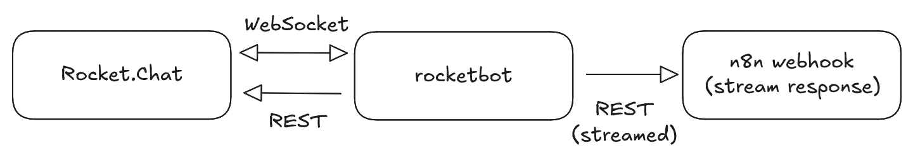

<div align="center">

<picture>
  <source media="(prefers-color-scheme: dark)" srcset=".github/assets/logo.webp">
  <source media="(prefers-color-scheme: light)" srcset=".github/assets/logo.webp">
  
</picture>

**Rocket.Chat bots with streaming message support.**

[](https://github.com/deichbewohner/rocketbot/actions/workflows/ci.yml)
[](https://github.com/deichbewohner/rocketbot/actions/workflows/github-code-scanning/codeql)
[](https://codecov.io/gh/deichbewohner/rocketbot)
[](https://goreportcard.com/report/github.com/deichbewohner/rocketbot)
[](https://github.com/deichbewohner/rocketbot/blob/release/go.mod)

</div>


## Features

- WebSocket-based Rocket.Chat client
- Streaming response updates (1-second buffering)
- Pluggable response generators (streaming + non-streaming)
- Multi-bot support
- HTTP API for programmatic triggers


## Architecture

<div align="center">
<picture>
  <source media="(prefers-color-scheme: dark)" srcset=".github/assets/architecture-dark.webp">
  <source media="(prefers-color-scheme: light)" srcset=".github/assets/architecture-light.webp">
  
</picture>
</div>


## Quick Start

```bash
# Copy config
cp .env.example .env

# Edit credentials
vim .env

# Run
( set -a; . .env; set +a; go run ./cmd/rocketbot )
```

## Security

- Not internet-facing. Do not expose the HTTP API publicly.
- Bind `API_ADDR` to `127.0.0.1` or a private interface and place behind
  authenticated proxy.
- Limit egress to only your Rocket.Chat host and configured webhook endpoints
  using firewall or network policies (iptables/nftables, eBPF, or Kubernetes
  NetworkPolicy).
- See `SECURITY.md` for the pragmatic policy.

## HTTP API

```bash
# Enable in .env (bind to loopback)
API_ADDR=127.0.0.1:8080
BOT1_SLUG=bob
BOT1_API_TOKEN=secret123

# Send message directly (no generator)
curl -X POST http://localhost:8080/api/v1/bots/bob/send \
  -H "Authorization: Bearer secret123" \
  -H "Content-Type: application/json" \
  -d '{"target":{"username":"alice"},"text":"Hello"}'
```

Target must specify exactly one of:
- `{"username": "alice"}` - Send DM to user
- `{"channel": "general"}` - Post to channel (# optional)
- `{"roomId": "ABC123"}` - Post to room ID

## Parsers

Built-in: n8n streaming webhooks. Implement `StreamParser` for other formats:

```go
type StreamParser interface {
    Parse(ctx context.Context, body io.Reader) (<-chan StreamEvent, error)
}
```

See `bot/n8n_parser.go` for reference.
